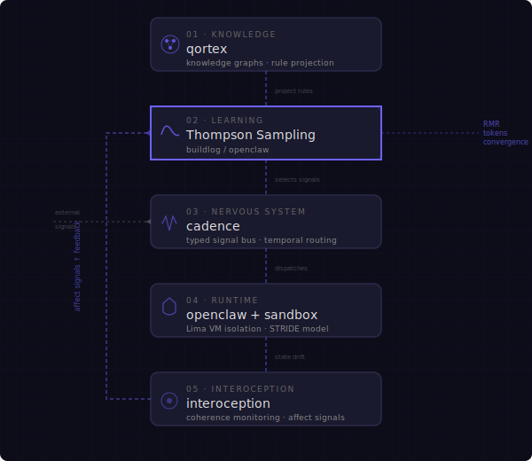

# Peleke Sengstacke

I study how languages work and build tools from what I find.

[Portfolio](https://peleke.me) · [Lab](https://peleke.me/lab) · [LinkedIn](https://linkedin.com/in/peleke) · [peleke@peleke.me](mailto:peleke@peleke.me)

---

### The Research Question

Can agents learn from their own performance?

Most systems marketed as "learning" are persisting context. Remembering, not adapting. I'm building the instrumentation to tell the difference: a five-layer architecture where learning can be observed and measured.

The [full lab page](https://peleke.me/lab) has the system diagram, hypotheses under investigation, and current project status.

---

### The System

| Layer | Project | What It Does |
|-------|---------|-------------|
| 01 · Knowledge | **[qortex](https://peleke.github.io/qortex/)** | Knowledge graph ingestion with typed edges and rule projection |
| 02 · Learning | **[buildlog](https://peleke.github.io/buildlog-template/)** / **[openclaw](https://peleke.github.io/openclaw/)** | Thompson Sampling over prompt components to measure what helps |
| 03 · Nervous System | **[cadence](https://peleke.github.io/cadence/)** | Typed signal bus for ambient agency with temporal routing |
| 04 · Runtime | **[openclaw](https://peleke.github.io/openclaw/)** + **[sandbox](https://peleke.github.io/openclaw-sandbox/)** | Agent runtime with process-level isolation via Lima VM |
| 05 · Interoception | **[interoception](https://peleke.github.io/interoception/)** | Internal coherence monitoring via conservation quantity tracking |

---

### Products

| Project | What It Is |
|---------|-----------|
| **[Interlinear](https://interlinear.peleke.me)** | Language tutor that distinguishes a typo from a conceptual gap. 5 error types, different interventions. |
| **[Swae OS](https://swae.peleke.me)** | Health platform with federated backend. GraphQL federation via Hive Gateway. |
| **[LinWheel](https://linwheel.io)** | Paste a transcript, get 7 publish-ready posts. Including the articles LinkedIn's API blocks. |
| **[LangLine](https://langline.dev)** | Mobile-first terminal for developers. SSH + tmux on your phone. |
| **[ComfyUI MCP](https://github.com/peleke/comfyui-mcp)** | 35+ MCP tools bridging Claude to distributed GPU compute. |
| **[Graphix](https://github.com/peleke/graphix)** | 201 MCP tools exploring the structural primitives of visual storytelling. |

---

### Background

**Princeton CS** · **Principal Engineer @ edX/2U** · **AI Systems Fellow @ Overclock** · **Partner @ Endstation LLC**
