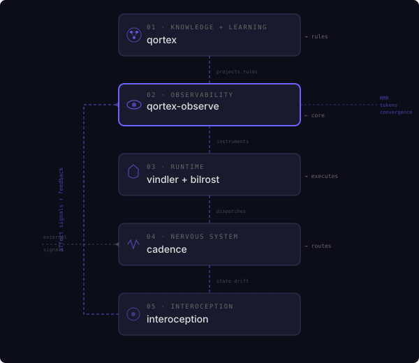

# Peleke Sengstacke

I build secure learning architectures for AI agent systems: infrastructure that lets agents improve from real usage without learning the wrong things.

[Portfolio](https://peleke.me) · [Lab](https://peleke.me/lab) · [Writing](https://peleke.me/writing) · [LinkedIn](https://linkedin.com/in/peleke) · [GitHub](https://github.com/peleke) · [peleke@pm.me](mailto:peleke@pm.me)

---

### The Problem I Work On

Agents that learn from usage can learn the wrong things just as easily as the right ones. I build the infrastructure that tells the difference.

The learning side is adaptive retrieval that updates from feedback. The security side is per-tool sandboxing and threat modeling for agents that touch real systems. Over both sits observability that shows what an agent is actually learning, so you can catch it when it drifts.

Most systems marketed as "learning" are persisting context. Remembering, not adapting. The work in the [lab](https://peleke.me/lab) exists to measure which one is happening and push it toward the former.

The [full lab page](https://peleke.me/lab) has the current diagram, the hypotheses under investigation, and per-layer status.

---

### The Stack (qlawbox)

A five-layer architecture for measuring whether an agent learns. Every layer is open source and runs today.

| Layer | Project | What It Does |
|-------|---------|-------------|
| 01 · Knowledge + Learning | **[qortex](https://peleke.github.io/qortex/)** | Retrieval over a typed-edge knowledge graph with a Thompson Sampling bandit that updates from accept/reject feedback. MCP server or REST. |
| 02 · Observability | **[qortex-observe](https://peleke.github.io/qortex/packages/observe/)** | A structured event for every selection and posterior update. OpenTelemetry to Jaeger, Prometheus to Grafana. |
| 03 · Runtime | **[vindler](https://peleke.github.io/openclaw/)** + **[bilrost](https://peleke.github.io/openclaw-sandbox/)** | Hardened agent runtime (a fork of OpenClaw) locked inside a Lima VM with per-tool, network-as-needed policy. |
| 04 · Nervous System | **[cadence](https://peleke.github.io/cadence/)** | Typed signal bus so agents act on event streams instead of waiting for prompts. |
| 05 · Interoception | **[interoception](https://peleke.github.io/interoception/)** | Experimental. The agent tracks its own learning dynamics and flags drift as affect signals. |

---

### Products

Each one ships to real users and stress-tests the stack in an architecture different enough to be honest about whether it generalizes.

| Project | What It Is |
|---------|-----------|
| **[Interlinear](https://interlinear.peleke.me)** ([case study](https://peleke.me/projects/interlinear)) | Language tutor that names each mistake by type instead of just right or wrong. Real morphology for Latin and Old Norse, not pattern matching. |
| **[LinWheel](https://linwheel.io)** ([case study](https://peleke.me/projects/linwheel)) | MCP server that gives a coding agent a full LinkedIn publishing pipeline. Voice profiles converge on your voice from approve/reject signals. |
| **[Swae OS](https://peleke.me/projects/mindmirror)** | Federated GraphQL health platform. Seven FastAPI services behind a Hive Gateway supergraph, shipped to Cloud Run by an OpenTofu CI/CD chain. Functional alpha. |

More repositories at [github.com/peleke](https://github.com/peleke).

---

### Selected Writing

Some of it co-authored with Claude, with author notes on each piece saying who did what.

| Essay | What It's About |
|-------|-----------------|
| **[The Double Agent Problem](https://peleke.me/writing/the-double-agent-problem)** | A compromised agent that does not break. It keeps completing your tasks while serving someone else's goals. |
| **[The Walls Come First](https://peleke.me/writing/the-walls-come-first)** | Why I sandboxed my agent runtime before I could trust it, and what I found underneath. |
| **[Learning Is Not Memory](https://peleke.me/writing/learning-is-not-memory)** | Frameworks ship "learning" that stores notes and retrieves them. Learning needs feedback, update rules, and convergence. |
| **[The Feedback Loop That Makes Retrieval Learn](https://peleke.me/writing/feedback-loop-retrieval-learns)** | How Thompson Sampling, edge-weight adjustment, and Personalized PageRank compose into retrieval that updates itself. |

---

### Background

Principal Engineer @ edX/2U ($60MM+ ARR Cybersecurity Bootcamp sandbox platform, AWS + Azure) · First engineer @ Trilogy ($750M acquisition to 2U) · Agentic AI SME @ Overclock Accelerator · AWS Certified Solutions Architect · Princeton
